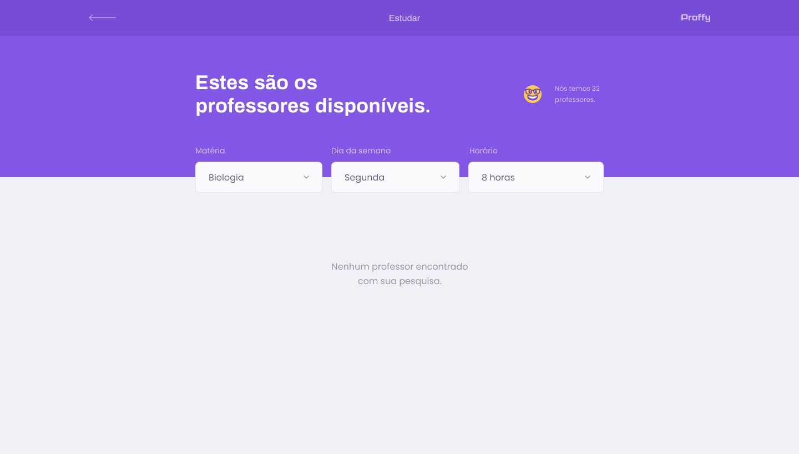
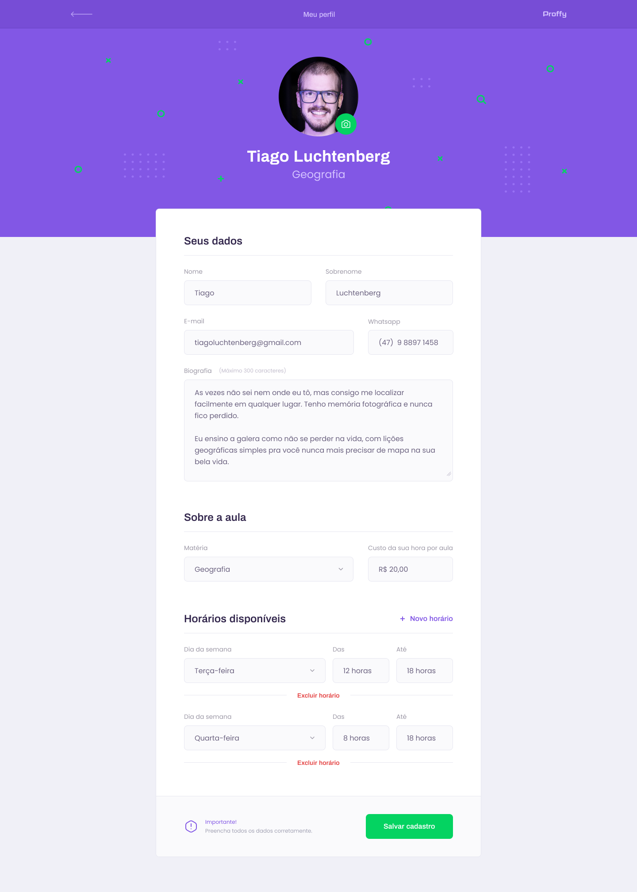

# Proffy 2.0

## Sobre o projeto

Aplicação Web desenvolvida durante a **Next Level Week 2.0** utilizando ReactJS.

Após o fim do evento, foi deixado alguns desafios para deixar o Proffy ainda mais incrível.

---

## Cadastro

Tela para cadastrar novos usuários na aplciação

## Login ✔️

Tela para o proffy se autenticar na aplicação

## Esqueci a Senha

Tela responsável por disponibilizar a possibilidade do usuário resetar sua senha caso tenha esquecido

---

## Home

Tela inicial da aplicação após o usuário fazer login

## Listagem

Tela para encontrar os proffys cadastrados na aplicação. São filtrados por matéria/dia/horário

## Atualização Perfil

Tela destinada para que o proffy possa atualizar suas informações

